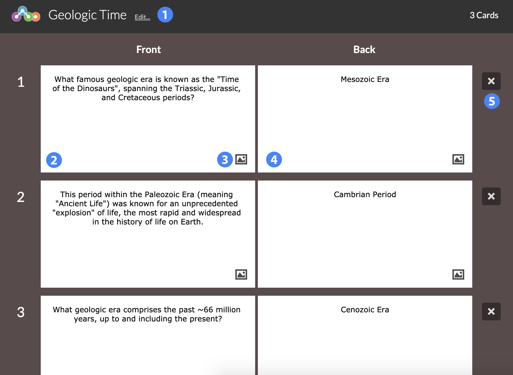

## Overview ##

Flash cards is a study tool using a virtual deck of two-sided cards.

1. Title of the widget
2. Card content, front side
3. Add an image to the card
4. Card content, back side
5. Delete this card

## Details ##

Flash Cards does not have a scoring component, but instead serves as a digital substitute for a physical deck of flash cards, a time-honored study aid. Cards can have any content added to the front or back side, including images.